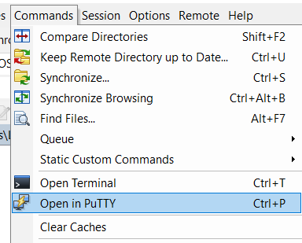
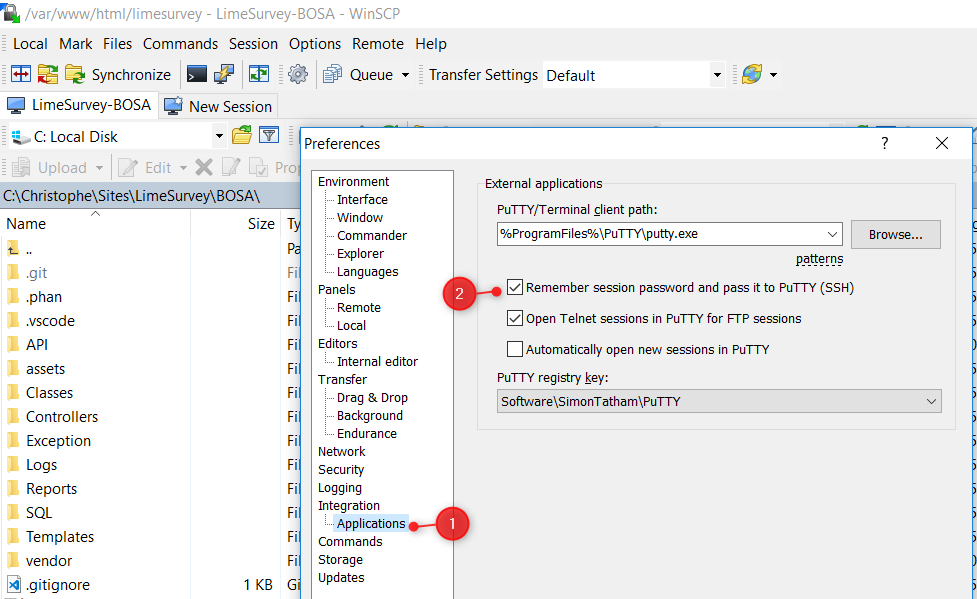

# Start PuTTY without typing a password

We can start a PuTTY console without typing the SSH password but just reuse the one of the FTP connection.

1. open your `Preferences`
2. in the `Integration`->`Application` tab (1) be sure to check `Remember session password and pass it to PuTTY` (2).

This way, you just need to provide the login name and that’s it.

