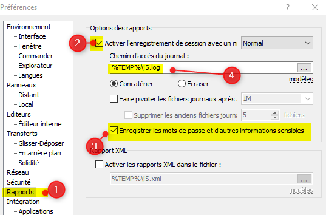

# Retrieve password

To retrieve an encrypted password with WinSCP, you'll need to enable the logging (see 1 and 2) and enable storing password (3).

1. Click on the `Report` menu item
2. Click on the `Enable session saving`
3. Click on the `Save password`

A file will then be created in the `%TEMP%` folder. His name will be the session name.

By opening that `.log` file in Notepad, you'll retrieve the password un-encrypted, in a plain-text format.
