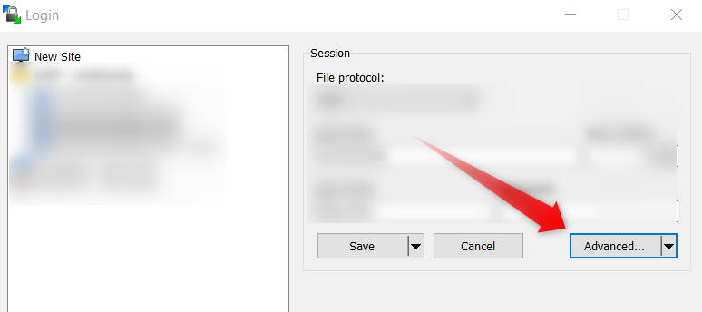
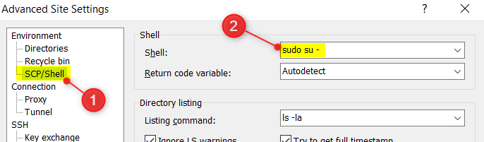

# Super User - Running command with SUDO SU

Due to the configuration done on the FTP server, it can happen that we can't create a folder or just uploading files by using a FTP like `WinSCP` even when we can do this by using a `SSH` connection (and by running a `sudo su` command).

`WinSCP` gives us a way to *force* such command:

* In the `Site Manager` window, click on the `Advanced` button

  

* Then go to `Environment` -> `SCP/Shell` and type `sudo su -` in the `Shell` entry

  

Try again and now, it should work.
